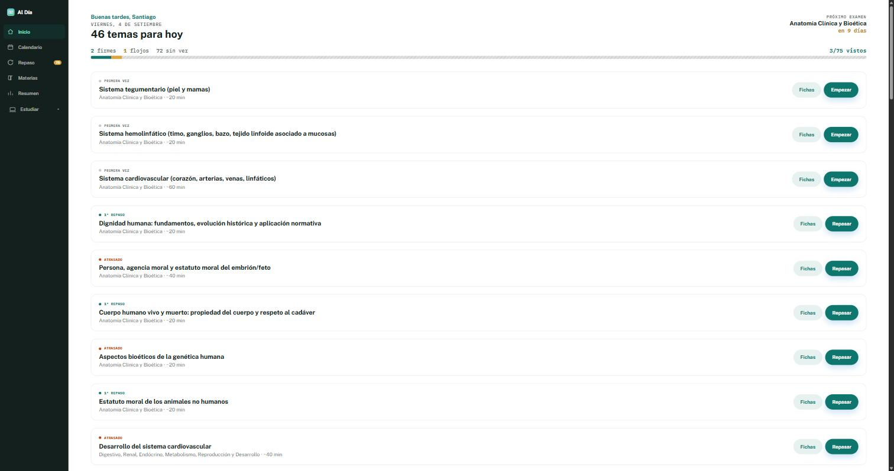
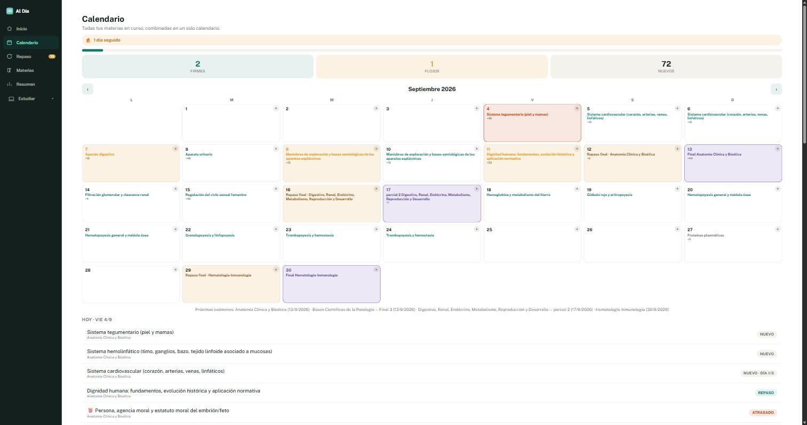

# Al Día

**App de estudio con repaso espaciado para estudiantes de medicina.**

Aplicación web instalable (PWA) que arma un calendario de estudio y repaso día por día para cada examen, y lo combina automáticamente cuando el estudiante cursa varias materias a la vez.

**Estado:** en producción, en pruebas con usuarias reales.
**Stack:** JavaScript (vanilla) · Node.js / Express · Supabase (Postgres + Auth) · API de Claude (Anthropic) · Web Push · PWA



---

## El problema

Los estudiantes de medicina manejan un volumen enorme de temas —en la Universidad de la República, más de 700 solo en la carrera de Doctor en Medicina— y suelen estudiar "una vez y se acabó", sin un sistema real de repaso. El resultado es una sensación constante de inseguridad: leer mucho y no saber si de verdad quedó firme.

## Funcionalidades

- **Repaso espaciado dinámico**, estilo Anki: cada tema tiene una única fecha de próximo repaso que se recalcula en cada acción. Si el tema queda *firme*, el intervalo se espacia (2 → 5 → 10 → 20 días); si queda *flojo*, vuelve a empezar. Los repasos futuros nunca quedan fijos de antemano.
- **Calendario global multi-examen**: con varias materias en curso, arma un único calendario combinado, priorizando la marcada como urgente y ajustando el ritmo de cada una según el margen real hasta su fecha de examen.
- **Fichas de repaso generadas con IA** (API de Claude), a partir del tema y su bibliografía real de cátedra, en formato clásico o de opción múltiple —ancladas a la fuente correcta en vez de contenido genérico.
- **Resúmenes de apuntes con IA**: se sube un PDF o Word y se devuelve un resumen estructurado como PDF descargable, generado del lado del servidor.
- **Catálogo curricular real**: 25 unidades curriculares y ~700 temas con bibliografía de cátedra asociada, para que el plan sea específico a lo que hay que estudiar.
- **Cuentas con sincronización entre dispositivos** (Supabase Auth + Postgres), con autoguardado y protección contra condiciones de carrera.
- **Notificaciones push reales**, incluida instalación en iOS/iPadOS, con un cron externo que dispara los recordatorios según la hora elegida por cada usuario.
- **Check-in adaptativo**: si un tema sigue flojo después de agotar el tiempo estimado, la app pregunta si insistir o avanzar, en vez de asumirlo en silencio.



## Cómo correrlo localmente

Requiere Node.js 18 o superior.

```bash
git clone https://github.com/santifilgueiras/al-dia.git
cd al-dia
npm install
cp .env.example .env
npm start
```

Queda en `http://localhost:3000` (o el puerto que definas en `PORT`).

### Variables de entorno

| Variable | Para qué |
|---|---|
| `SUPABASE_URL`, `SUPABASE_ANON_KEY`, `SUPABASE_SERVICE_ROLE_KEY` | Base de datos y autenticación |
| `ANTHROPIC_API_KEY`, `ANTHROPIC_MODEL` | Generación de fichas y resúmenes |
| `VAPID_PUBLIC_KEY`, `VAPID_PRIVATE_KEY`, `VAPID_SUBJECT` | Claves de notificaciones push |
| `PUSH_CRON_SECRET` | Protege el endpoint que dispara los recordatorios |
| `IA_HABILITADA`, `IA_TOPE_DIARIO` | Interruptor y tope diario de uso de IA, para controlar el costo |

`.env` está en `.gitignore` y no se versiona.

## Estructura

```
server.js       Servidor Express y API
sw.js           Service Worker (offline + push)
manifest.json   Manifest de la PWA
landing.html    Página de presentación
instalar.html   Instrucciones de instalación en el celular
lib/            Lógica de la aplicación
data/           Catálogos curriculares y temarios
scripts/        Utilidades de mantenimiento
test/           Tests (node --test)
```

## Tests

```bash
npm test
```

## Sobre el proyecto

Nació de un problema real y se construyó como validación de una idea de negocio, no como ejercicio de práctica: catálogo curricular real, bibliografía real por tema y pruebas de uso antes de cada mejora. Cada ronda de funcionalidades se verificó de punta a punta —backend con pruebas directas a la API y frontend en un navegador real— antes de darla por terminada.

## Autor

**Santiago Filgueiras** — estudiante de Ingeniería en Sistemas (UdelaR). Montevideo, Uruguay.
